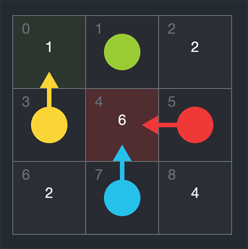

# Socket Battle Client

Welcome to the socket battle client! It's quick and easy to get up and running.

## Getting started
1. Download this repository from Github
2. Fill in your teams details in the info.js file.
2. Build your algorithm in the logic.js file
3. Open up your index.html to see your algorithm battle

## How to play


The game consists of a 3x3 board with 4 players standing around the middle tiles on each side.
On all other tiles are points in varying amount that players can take. But there's a catch - if two or more players pick the same tile, those players won't get any points that round.
Your task is to write an AI that predicts patterns of how your opponents play to maximise your own score.
For a more visual example see [Super Mario Party - Air To A Fortune](https://www.youtube.com/watch?v=zP8WrEG_aVU) ;)

A game consists of 100 rounds to ensure that you have enough data to predict patterns and adjust your strategy.

## Ok, that's fine... So how do I write my algorithm?
In the root folder of the project that you've downloaded from Github you will find a file called logic.js.
It's here that you will create your magic! :D

The file consists of a single function and your job is to return one value - The index of the tile that you want to choose.
To help you with this you will get som data in the form of a game object.


## Payload
```js
const game = {
  playerId: 'A',
  tiles:[ 4, 'C', 4, 'B', 9, 'D', 2, 'A', 2 ],
  history:[
    {
      before: [ 3, 'B', 5, 'D', 3, 'C', 2, 'A', 3 ],
      after: [ 3, '', 'B', '', 'C,D', '', 2, 'A', 3 ]
    }
  ]
}
```

| Property              | Description |
| --------------------- | ----------- |
| playerId              | Your id |
| tiles                 | Describes the game board. Each position in the array corresponds to a tile id on the board (first position is 0, second is 1 etc). If a tile contain points it will be a number of a random value. If the tile contains a player it will be the id of that player |
| history               | An array of rounds that has previously been played this game |
| history[index].before | Same format as `game.tiles` Describes what the board looked like before any players made a move |
| history[index].after  | Same format as `game.tiles` Describes what the board looked like after players chose a tile |


### game.playerId
Your id. 

### game.tiles
Describes the game board. Each position in the array corresponds to a tile id on the board (first position is 0, second is 1 etc). If a tile contain points it will be a number of a random value. If the tile contains a player it will be the id of that player

### game.history
An array of rounds that has previously been played this game

### game.history.before
Same format as `game.tiles` Describes what the board looked like before any players made a move

### game.history.after
Same format as `game.tiles` Describes what the board looked like after players chose a tile
